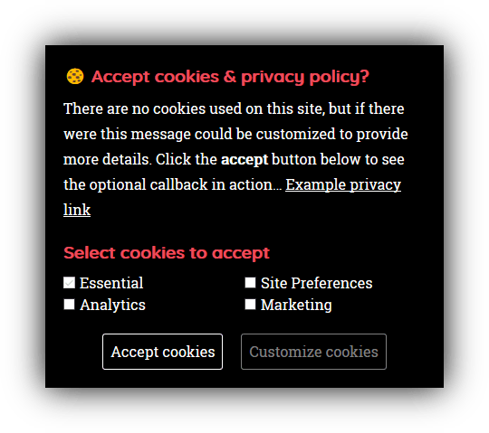

# GDPR 🍪 jQuery plugin

Inspired by [ihaveacookie](https://github.com/ketanmistry/ihavecookies).

A jQuery plugin that displays a GDPR-compliant cookie consent message as required by EU regulation. The plugin displays a message when a visitor first visits your website and, by default, again 30 days after their last visit.



The visitor must click the accept button in order for consent to be granted, as is required by EU regulation. No cookie set means no consent, which means your site is only allowed to set essential cookies.

## Installation

Several ways to obtain this plugin.

### Plain download

You can download a [release](https://github.com/thany/gdpr-cookie/releases) or an [archive](https://github.com/thany/gdpr-cookie/archive/master.zip) and place it where you want in your project.

### NPM

Install via [NPM](https://www.npmjs.com/):

```
npm i gdpr-cookie
```

### Yarn

Install via [Yarn](https://yarnpkg.com/):

```
yarn add gdpr-cookie
```

### Bower

Install via [Bower](https://bower.io/):

```
bower install gdpr-cookie
```

### Meteor

Install via [Meteor](https://www.meteor.com/):

```
meteor add thany:gdpr-cookie
```

## Usage

If your site already uses jQuery, make sure it's at version 1.7.4 or later. jQuery 2.x and 3.x will also work fine. Not using jQuery yet? [Download jQuery](http://jquery.com/download/) and choose whichever method suits you best to include it on your site.

Download the latest version of `gdpr-cookie` and place it in your html, like so:

```html
<script src=/path/to/gdpr-cookie.js></script>
```

You can also use AMD or CommonJS, which makes it easier to choose and use a packager like Webpack or Rollup to bundle your stuff.

After that you can initialize the script like so:

```javascript
$.gdprcookie.init();
```

This will give you the default options.

## Styling

The plugin by itself does not do any styling. You are responsible for making the popup look good. It's going to look different on each website anyway, but if you need some sort of starting point, you could have a look at `gdpr-cookie.css` which is also included when you download this plugin.

## Settings

Settings can be added in two ways. One way is 'the jQuery way' by passing it into the plugin call, like so:

```javascript
$.gdprcookie.init({
    title: "...",
    message: "..."
    // etc.
});
```

Alternatively, you can put the settings in a global variable. This is useful when a server outputs these texts, e.g. for globalization/internationalization purposes. This way you can keep the main plugin call in your separate javascript file. Works like this:

```html
<script>
    window.GdprCookieSettings = {
        title: "...",
        message: "..."
        // etc.
    };
</script>
```

You can also combine the two, to keep functional settings separate from localization.

### title

The title that will be rendered at the very start of the popup. It'll be rendered as a `<h1>` tag. No html is allowed. Default is `"Cookies & privacy"`.

### subtitle

The title that will be rendered above the checkboxes after pressing the customize button. It'll be rendered as a `<h2>` tag. No html is allowed. Default is `"Select cookies to accept"`.

### message

A passage of text that can serve as an introduction and a means to include a link to your privacy policy. Html is allowed. Default is a long text. You'll want to set this option for sure.

### delay

A delay in milliseconds to wait until displaying the popup after the page has loaded (meaning the `DOMContentReady` event, a.k.a. jQuery's document-ready). This delay is not applied when manually displaying the popup. You can supply a value of `0` to disable any delay. The default is 2000.

### expires

The time in days for the cookie expiry. This means the cookie that remembers what the visitor has chosen. Cookies *you* set, are unaffected. Default is 30 days.

### cookieName

The name of the cookie to write to. Any characters forbidden in a cookie name (as per the specification) will automatically be removed. Default is `"cookieControlPrefs"`.

### acceptReload

Whether or not to reload the page after the user presses the accept button. Default is `false`.

### acceptBtnLabel

Label for the accept button. No html is allowed. Default is `"Accept cookies"`.

### advancedBtnLabel

Label for the customize button. No html is allowed. Default is `"Customize cookies"`.

### customShowMessage

Callback function for when to show the popup, if you're not satisfied with the default `fadeIn`.

### customHideMessage

Callback function for when to hide the popup, if you're not satisfied with the default `fadeOut`. If you supply this callback, you are responsible for removing the popup from the DOM!

### customShowChecks

Callback function for when to show the checkboxes, if you're not satisfied with the default `slideDown`.

### cookieTypes

An array of objects containing the types of cookies you need to specify. Each object has three properties:

`type` - A title to show on the label next to the checkbox.  
`value` - A unique name for the type of cookie (e.g. `"essential"`, `"marketing"`, etc).  
`description` - An optional description that will be rendered in the `title` attribute of the correcponding `<label>`.
`checked` - A boolean determining if the cookie type is checked by default.

## Events

A set of events are available that will be triggered on the `<body>` element. And you can catch them for some extra control, logging, or customization.

You can use them as follows:

```javascript
$("body").on(eventName, function() {
    // Do something...
});
```

### gdpr:show

Triggered when the popup is shown. Either manually or on page load.

### gdpr:accept

Triggered when the visitor presses the accept button.

### gdpr:advanced

Triggered when the visitor presses the customize button.

## Methods

The following methods exist for some extra control.

### $.gdprcookie.preference()

Returns an array of values, which are the ones specified in `settings.cookieTypes`, that the visitor has chosen to accept. This array is empty when the visitor hasn't pressed the accept button yet.

### $.gdprcookie.display()

Manually displays the popup, e.g. for visitors to change their preferences. It's considered good practice to include a link to this somewhere on your site.

## Cookie

When the visitor presses the accept button, the cookie `cookieControlPrefs` (name can be customized) will contain an array of accepted cookie types e.g. `["preferences", "analytics"]`. This will enable you to perform additional checks where necessary within your application with regard to GDPR regulations. These cookies are accessible by the server as well, enabling you to choose whether or not to render certain passages of code that do or don't comply with the visitor's preferences.

## Conditionally render

One of the things you'll want to do, is conditionally render passages of html that do or don't comply with the visitor's preferences. I'd advice you to completely omit the html that doesn't comply, to make sure nothing of it gets loaded.

Here's one way to do it in pure javascript:

```html
<script>if ($.gdprcookie.preference("marketing")) { document.write(`

    Some marketing html goes here

`); }</script>
```

However, since they are usually `<script>` tags, the end-tag of it needs to be escaped to something like `</${''}script>`. So it becomes:

```html
<script>if ($.gdprcookie.preference("marketing")) { document.write(`

    <script>// Some marketing script goes here</${''}script>

`); }</script>
```

This uses [template literals](https://developer.mozilla.org/en-US/docs/Web/JavaScript/Reference/Template_literals) (note the `` ` `` backticks) to easily conditionally render multiple lines of html. Template strings are unavailable on Internet Explorer (but they are on Edge!).

### With IE support

An alternative way is to use non-standard multi-line strings. When doing this, take note of which quote characters your marketing script contains, and don't use those. It might become something like this:

```html
<script>if ($.gdprcookie.preference("marketing")) { document.write("\
\
    <script>// Some marketing script goes here</"+"script>\
\
"); }</script>
```

As you can see, this requires a `\` at the end of each line, including empty lines. It also still requires `</script>` to be escaped to `</"+"script>` (or `</'+'script>`). Less comfortable and not in compliance with any ECMAScript standard, but at least this will work on Internet Explorer.

### Frameworks

If you're using a frontend template framework, you're better off using that. There are many such frameworks, and each has its own way to conditionally outputting html. Not all support outputting `<script>` tags, but some do it just fine.

### On the server

The best way to conditionally render a passage of html, is to do it on the server. That's what it does best. So, to take a random popular serverside scripting language, it might become something like this:

```php
<?php if (gdpr_cookie_set('marketing')): ?>

    <script>// Some marketing script goes here</script>

<?php endif; ?>
```

It looks a lot cleaner. And it is. Other languages and other serverside template frameworks can do this in similar ways.
Also, please note that the above function `gdpr_cookie_set` doesn't actually exist. You'll have to build something in your serverside script to check these cookies.

## Changelog

See [Changelog](CHANGELOG.md).

## License

This plugin is available under the [MIT license](LICENSE.md).

## Credit

Credit where credit is due: this plugin is heavily inspired on [ihavecookies](https://github.com/ketanmistry/ihavecookies) by [Ketan Mistry](https://iamketan.com.au/). I chose not to fork because of the heavy modifications I was planning to do.